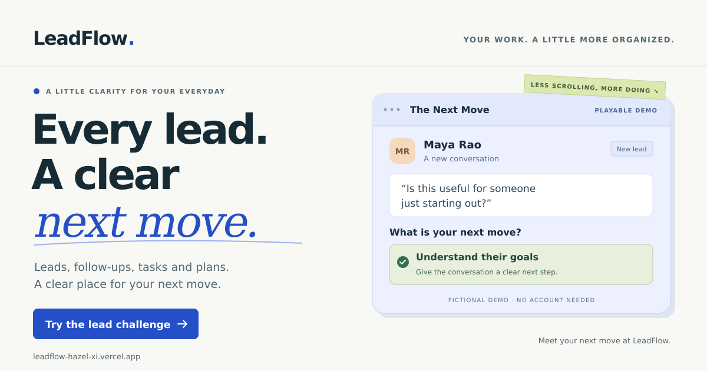

<div align="center">

  

  <h1>LeadFlow</h1>

  <p>A deployed, full-stack CRM for secure lead management, reusable marketing plans, follow-ups, pipeline analytics, and activity tracking.</p>

</div>

## Overview

LeadFlow is a full-stack, role-based CRM application for sales and marketing teams. It combines lead tracking, follow-up scheduling, personal tasks, pipeline analytics, interaction histories, and reusable marketing plans in one responsive workspace.

The application uses a React and Redux Toolkit frontend, an Express REST API, MongoDB Atlas, JWT and Google authentication, record-level authorization, secure password recovery, and automated activity tracking. Both the frontend and backend are deployed on Vercel.

## Live Demo

- Application: [Open LeadFlow](https://leadflow-hazel-xi.vercel.app)
- API health: [Check LeadFlow API](https://leadflow-api-liard.vercel.app/api/health)

## Project Status

**Current version: v1.8.0 — Public homepage and interactive demo.**

The public homepage is deployed on Vercel with the playable lead challenge, support contact choices, Plus Jakarta Sans typography, logo navigation, missing-page screen, and sharing metadata/artwork. Frontend lint/build and local browser checks passed. Production checks also passed for the homepage/game, font loading, Gmail support recipient, sign-in and Home/dashboard navigation, protected-page refresh and logout, mobile navigation, unknown-route refresh, sharing image, and page-source metadata.

The Follow-ups workspace, personal-task actions, and scheduling from Lead Details are merged into `main` and deployed to both Vercel production projects. Backend integration checks, frontend lint/build, and local browser checks passed. Production deployment and browser verification were confirmed on 14 September 2026.

Authentication, account security, lead management, pipeline analytics, lead-detail pages, interaction notes, activity history, and marketing-plan management remain part of the deployed application.

The shared application layout includes Follow-ups & Tasks alongside Dashboard, Marketing Plans, and Profile, with responsive navigation and session recovery.

Shared-database follow-up initialization and its read-only audit passed, with no unresolved leads or blockers at that checkpoint. The roadmap below lists subsequent work.

## Features

### Public homepage

- Public `/` route for visitors and signed-in users
- The Next Move: three fictional lead conversations with choices, feedback, a score, and replay
- Interactive previews of leads, personal tasks/follow-ups, marketing-plan templates, and activity history
- Registration and login links for visitors, with a dashboard shortcut for a checked, active, verified session
- Consistent Home links on the LeadFlow logos in the workspace and authentication pages
- Public missing-page screen with Home and login/dashboard links
- Responsive layout, keyboard navigation, and reduced-motion support
- Default page metadata and Open Graph/X card metadata with a 1200 × 630 PNG
- Public support contact: [leadflow.support.help@gmail.com](mailto:leadflow.support.help@gmail.com)
- Expandable support options with a Gmail compose link, email-app link, and selectable address
- Plus Jakarta Sans variable font for the interface, bundled locally through Fontsource

The challenge uses fictional data held in browser memory. It does not create leads or tasks, send messages, or modify an account. Its score is a demo result, not a prediction of sales or earnings. Email support expands contact options. Visitors can open Gmail in a new tab, use their configured email application, or copy the displayed address. Gmail may require sign-in, and the visitor reviews and sends their own message. The Gmail compose URL is a convenience link, not an application API dependency.

The frontend imports `@fontsource-variable/plus-jakarta-sans/wght.css` and `src/styles/typography.css` after its existing global stylesheet in `src/main.jsx`. The shared font variables cover normal interface text and Tailwind's `font-sans` utility. The homepage uses the shared sans-serif family alongside its existing serif accents. Existing image assets contain their own artwork. See [Fontsource installation](https://fontsource.org/fonts/plus-jakarta-sans/install).



### Authentication and account security

- Email/password registration with email ownership verification before login
- Pending registration responses without an authentication token
- Public verification and resend pages, with an explicit action to consume email links
- Single-use verification links that expire after 24 hours
- Google authentication for new and existing users
- Google profile-picture support
- Password hashing with bcryptjs
- JWT-protected frontend and API routes
- System roles: `admin`, `leader`, `member`, and `viewer`, with resource-specific permissions described below
- Active-user checks and persistent authenticated sessions
- Session verification with retry after temporary API failures
- Recovery from invalid sessions without treating temporary network errors as logout
- Secure name and password updates
- Verified email changes: the current login address remains active until the new address is verified
- Persistent pending-email notices and cancellation from Profile
- Versioned JWT sessions that invalidate older tokens after password changes, resets, and successful email verification
- Email-based password recovery with single-use, SHA-256-hashed tokens
- Password-reset links that expire after 15 minutes
- Recovery that verifies ownership of the account email and clears pending email changes
- MongoDB-backed authentication rate limits shared across server instances

### Lead management

- Create, retrieve, update, and delete leads
- Five-stage pipeline: new, contacted, qualified, converted, and lost
- Search by name, email, or phone and filter by pipeline status
- Track lead source, contact details, notes, and next follow-up date
- Dedicated lead-detail pages
- Ownership-aware access for assigned leads

### Follow-ups and personal tasks

- Protected **Follow-ups & Tasks** workspace at `/follow-ups`
- Today, Overdue, Upcoming, All pending, No date, Completed, and Cancelled views
- Search task titles/descriptions, filter by task type, and paginate results
- Create personal tasks with an optional due date and time
- Schedule multiple separate follow-ups from an accessible lead's details page
- Edit pending tasks, reschedule them, record completion outcomes, or cancel them
- Retain completed and cancelled task history; filter completed work by Today or Yesterday
- Display dates in the device's local timezone and send UTC timestamps to the API
- Keep each lead's next follow-up synchronized with its earliest pending task
- Record lead follow-up scheduling, rescheduling, completion, and cancellation in the activity timeline
- Restrict task records to their owner, including for admins and leaders
- Give viewers read access within their scope, with no lead, note, or task mutation controls
- Reject stale task changes using version checks and refresh the task before another edit

Task types are fixed when created. Completing a follow-up preserves it as history; scheduling the next conversation creates a separate task. Team task assignment and scheduled reminder delivery are planned features.

### Marketing-plan management

- Create reusable marketing and lead-conversion plans
- Store descriptions, target audiences, outreach pitches, and follow-up steps
- Draft, active, and archived plan states
- Search, status filtering, and paginated listings
- Admin access to manage every plan
- Leader access to create and manage owned plans
- Member access restricted to active plans
- Soft deletion through archival to preserve plan history

### Notes, activity, and analytics

- Add, edit, and delete dated interaction notes
- Author and role-based note permissions
- Automatic tracking of lead, status, follow-up, and note changes
- Chronological activity timeline with user attribution
- KPI cards for every pipeline stage
- Conversion-rate, upcoming follow-up, and overdue follow-up analytics

Dashboard follow-up metrics count leads using their next pending follow-up date. The Follow-ups workspace counts task records; several tasks can belong to one lead, so these totals can differ.

### User experience

- Responsive React and Tailwind CSS interface
- Shared protected layout for Dashboard and Leads, Follow-ups & Tasks, Marketing Plans, and Profile
- Responsive desktop navigation and a mobile navigation drawer
- Keyboard focus handling and focus restoration for the mobile drawer
- Consistent page headings and shared profile/logout controls
- Redux Toolkit state management
- Loading, empty, validation, success, and controlled error states
- Refresh-safe React Router routes on Vercel

## Tech Stack

| Layer | Technologies |
| --- | --- |
| Frontend | React, Vite, Redux Toolkit, React Router, Axios, Tailwind CSS, Lucide React |
| Backend | Node.js, Express.js, Nodemailer, ipaddr.js |
| Database | MongoDB Atlas, Mongoose |
| Authentication | JSON Web Token, bcryptjs, Google Identity Services |
| API | RESTful API |
| Deployment | Vercel |

## Application Flow

Visitors can open `/` to explore the public homepage and play the fictional lead challenge before creating an account. A signed-in user can also visit Home and return through the dashboard shortcut. Protected workspace routes continue to require a valid session.

Email/password registration creates a pending account and directs the user to email verification. Opening the email link displays a verification page; clicking **Verify email** consumes the token. The user then signs in to enter the protected shared layout. Registration itself does not issue a JWT.

Google sign-in verifies the ID token and applies the account-linking and email-ownership checks before issuing a session. A matching email alone does not activate an existing unverified password account.

Authenticated users can manage records within their access scope, open a lead's notes and activity history, browse marketing-plan templates, and update their profile.

Tasks are the source of truth for follow-ups. Each lead's `nextFollowUp` is a cached value of its earliest pending follow-up, updated with the task and activity records in a MongoDB transaction. Completing, cancelling, or rescheduling that task recalculates the next date; no pending follow-ups means a null date. Personal tasks are separate and do not create lead activity.

New tasks belong to the user creating them. Scheduling a follow-up on another accessible user's lead does not assign that task to the lead owner. Imported legacy follow-ups retain the lead's assigned user. Team assignment controls are planned.

Marketing plans store reusable pitches and follow-up steps. Tracking each person's progress through a plan is planned work.

Changing an email address requires the current password. The new address stays pending until verified, and the user can cancel the request from Profile. A Google-only account must first set a password through password recovery to use this flow. Completing a reset or email verification requires a fresh sign-in.

## API Endpoints

### Authentication

| Method | Endpoint | Access | Purpose |
| --- | --- | --- | --- |
| POST | `/api/auth/register` | Public | Create a pending account and send verification email; no JWT |
| POST | `/api/auth/login` | Public | Sign in to an active, verified account and receive a JWT |
| POST | `/api/auth/google` | Public | Authenticate with Google subject to ownership/linking checks |
| POST | `/api/auth/verify-email` | Public | Consume a verification token supplied in the request body |
| POST | `/api/auth/resend-verification` | Public | Request verification of the current account email |
| POST | `/api/auth/forgot-password` | Public | Request a password-reset email |
| PATCH | `/api/auth/reset-password/:token` | Public | Reset the password, verify the email, and invalidate prior sessions |
| GET | `/api/auth/me` | Authenticated | Retrieve the current user |
| PATCH | `/api/auth/profile` | Authenticated | Update the name or request a verified email change |
| PATCH | `/api/auth/password` | Authenticated | Change password and issue a new JWT |
| DELETE | `/api/auth/pending-email` | Authenticated | Cancel a pending email change and invalidate its link |

Authenticated routes require an active, email-verified account and a current JWT. Verification links use `/verify-email#token=...`; visiting the page does not consume a token through a GET request. To resend a pending email-change request, submit the pending address and current password through Profile after the cooldown.

### Leads

| Method | Endpoint | Access | Purpose |
| --- | --- | --- | --- |
| POST | `/api/leads` | Admin/Leader/Member | Create a lead |
| GET | `/api/leads` | Authenticated | List accessible leads |
| GET | `/api/leads/:id` | Authorized | Retrieve one lead |
| PATCH | `/api/leads/:id` | Authorized Admin/Leader/Member | Update a lead |
| DELETE | `/api/leads/:id` | Authorized Admin/Leader/Member | Delete a lead and related records |

Supported queries include `status` and `search`:

```text
GET /api/leads?status=qualified
GET /api/leads?search=Amit
GET /api/leads?status=new&search=Sharma
```

Lead creation can include an initial `nextFollowUp` date and creates its corresponding task. General lead edits omit this field; schedule or change subsequent follow-ups through the Task API. A changed legacy `nextFollowUp` value in a lead PATCH is rejected. Deleting a lead removes its linked tasks, notes, and activity; personal tasks are unaffected.

### Tasks

All routes require authentication. Read access is owner-only for every role, with an additional lead-access check for linked follow-ups. Writes require `admin`, `leader`, or `member`; the server chooses the owner and creator.

| Method | Endpoint | Purpose |
| --- | --- | --- |
| GET | `/api/tasks` | Search, filter, and paginate the current user's accessible tasks |
| POST | `/api/tasks` | Create a personal task or a lead follow-up |
| GET | `/api/tasks/:id` | Retrieve one accessible task |
| PATCH | `/api/tasks/:id` | Edit a pending task's title, description, or due date |
| POST | `/api/tasks/:id/complete` | Complete a pending task and save an optional outcome |
| POST | `/api/tasks/:id/cancel` | Cancel a pending task while retaining its history |

Creation accepts `title`, optional `description`, `kind`, `dueAt`, and `leadId` where applicable. `kind=personal` permits no due date and no lead; `kind=follow_up` requires both `leadId` and `dueAt`. The type, lead, and owner cannot be changed through task editing.

Task responses include a numeric `version`. Include that current version in every PATCH, complete, or cancel request. Completion also accepts `completionNote`. Stale versions or attempts to change a terminal task return HTTP `409`; completed and cancelled tasks cannot be reopened or edited through this API.

List queries support `status`, `kind`, `leadId`, `search`, `page`, `limit`, `dueFrom`, `dueBefore`, `completedFrom`, `completedBefore`, and `undated`. The defaults are pending tasks, all kinds, page 1, and 20 rows; the maximum limit is 50. `search` matches titles and descriptions. Date ranges use UTC ISO timestamps ending in `Z`, inclusive `From` bounds, and exclusive `Before` bounds. Completion ranges require `status=completed`.

```text
GET /api/tasks?status=pending&kind=follow_up&page=1&limit=12
GET /api/tasks?status=pending&kind=personal&undated=true
GET /api/tasks?status=completed&search=webinar
```

List responses contain `tasks` and `pagination`; single-task and write responses contain `task`, alongside `success`.

### Marketing plans

| Method | Endpoint | Access | Purpose |
| --- | --- | --- | --- |
| POST | `/api/plans` | Admin/Leader | Create a plan |
| GET | `/api/plans` | Authenticated | Search, filter, and paginate accessible plans |
| GET | `/api/plans/:id` | Authenticated | Retrieve an accessible plan |
| PATCH | `/api/plans/:id` | Admin/Owner Leader | Update a plan |
| DELETE | `/api/plans/:id` | Admin/Owner Leader | Archive a plan |

```text
GET /api/plans?status=active
GET /api/plans?search=Social
GET /api/plans?status=draft&page=1&limit=10
```

### Notes, activities, dashboard, and health

| Method | Endpoint | Access | Purpose |
| --- | --- | --- | --- |
| GET | `/api/leads/:id/notes` | Authorized | List interaction notes |
| POST | `/api/leads/:id/notes` | Authorized Admin/Leader/Member | Add an interaction note |
| PATCH | `/api/leads/:id/notes/:noteId` | Author/Admin/Leader | Edit a note |
| DELETE | `/api/leads/:id/notes/:noteId` | Author/Admin/Leader | Delete a note |
| GET | `/api/leads/:id/activities` | Authorized | Retrieve lead activity |
| GET | `/api/dashboard/stats` | Authenticated | Retrieve dashboard KPIs |
| GET | `/api/health` | Public | Check API health |

Note mutations also require an Admin/Leader/Member role and the existing lead/note access checks. Viewers cannot create, edit, or delete notes, including notes they previously authored.

## Getting Started

### Prerequisites

- Node.js 20.19+
- npm
- A MongoDB Atlas cluster or another MongoDB replica set/sharded deployment that supports transactions
- Google OAuth web client
- A Gmail sender with a Google App Password for verification and recovery email delivery

### Installation

```bash
git clone https://github.com/PankajPraja1/LeadFlow.git
cd LeadFlow

cd backend
npm install

cd ../frontend
npm install
```

### Backend environment

Create `backend/.env`:

```env
PORT=5000
MONGODB_URI=your_transaction_capable_mongodb_connection_string
JWT_SECRET=replace_with_a_long_random_secret
CLIENT_URL=http://localhost:5173
GOOGLE_CLIENT_ID=your_google_web_client_id
EMAIL_USER=your_support_account@gmail.com
EMAIL_APP_PASSWORD=your_google_app_password
```

The follow-up and lead-write services require MongoDB transactions; a standalone local MongoDB server is not sufficient. Use a separate development database for new installations and experiments. The existing project's shared-database initialization is described below.

### Frontend environment

Create `frontend/.env`:

```env
VITE_API_URL=http://localhost:5000/api
VITE_GOOGLE_CLIENT_ID=your_google_web_client_id
```

The Google Client ID is public browser configuration. Database, JWT, and email credentials must remain backend-only and must never use the `VITE_` prefix. Never commit real `.env` files.

### Run locally

Start the backend:

```bash
cd backend
npm run dev
```

Start the frontend in another terminal:

```bash
cd frontend
npm run dev
```

Open `http://localhost:5173`.

### Validation

From `backend`:

```bash
npm test
npm run test:rate-limit
```

`npm test` runs 28 email-verification and account-security tests with mocked database and external-service dependencies. `npm run test:rate-limit` uses the MongoDB connection configured in `backend/.env`; run it against a development database. It checks IP normalization, concurrent counting across limiter instances, persistence across instances, window rollover, and storage-failure handling. It deletes only its own uniquely scoped test counters and sends no emails.

The Follow-ups integration checks also run from `backend`:

```bash
node test/followUpService.integration.cjs
node test/leadWriteService.integration.cjs
node test/taskApi.integration.cjs
node test/followUpMigration.integration.cjs
```

These four scripts use the configured cluster with separate, randomly named temporary databases and clean up their own test collections. The database credentials must permit those test databases and the topology must support transactions. They cover rollback, concurrent changes, single legacy import, lead-date synchronization, ownership and viewer rules, version conflicts, lead deletion, and migration behavior.

From `frontend`:

```bash
npm run lint
npm run build
```

For v1.8.0, local checks passed for homepage/game behaviour, feature tabs, logo navigation, protected navigation, the public missing-page screen, and keyboard/mobile behaviour. The support disclosure, Gmail contact option, selectable address, and custom-font browser checks also passed. Frontend lint completed without reported problems. Vite 8.3.0 built 1,966 modules in 3.30 seconds and emitted the Plus Jakarta Sans font assets. Its plugin-timing diagnostic did not prevent a successful build.

Production checks for v1.8.0 passed: the public homepage, challenge, and custom font while logged out; Gmail support with the correct recipient; sign-in and Home/dashboard navigation; workspace refresh and logout protection; mobile navigation and unknown-route refresh; and the public sharing image and initial HTML metadata.

The sharing artwork's PNG format and 1200 × 630 dimensions, metadata image paths, and static metadata structure were checked during preparation. The image and metadata were also confirmed on production. Sharing services control the rendering and caching of their own link previews.

For v1.7.0, backend integration checks and frontend lint/build passed locally. Browser validation covered protected navigation, filters, personal-task creation/editing, completion outcomes and persistence, cancellation, discarded drafts, stale edits across tabs, and scheduling multiple lead follow-ups. Completing the earliest follow-up advanced the lead's next date and retained the activity history. Viewer scheduling controls were absent.

Production checks for v1.7.0 passed on 14 September 2026: protected `/follow-ups` refresh and production API routing; personal-task editing, completion outcomes, persistence, and cancellation; multiple lead follow-ups, earliest-date advancement, and retained activity; stale edits across tabs; owner isolation and viewer controls; existing Dashboard, Plans, Profile, mobile navigation, and logout protection.

The previous v1.6.0 production checks passed for registration and verification email delivery, production email links, rejection of reused verification tokens, older-account access and data preservation, password recovery across sessions, pending-email cancellation, Google sign-in, and protected-page refresh.

### Existing follow-up dates

The migration turns a legacy lead date into one pending follow-up task and marks initialization, including for leads without a date. It preserves the original date and does not invent completed history. New leads are initialized by the current write service.

To inspect the configured database without writing, run from `backend`:

```bash
node scripts/migrateFollowUps.cjs
```

The existing local and Vercel instances share the Atlas database `leadflow`. Its initialization and subsequent audit already passed with no remaining work or blockers at the migration checkpoint. Further workspace deployment does not require applying that migration again.

For a different database that still has legacy records, review the audit before planning a controlled migration. Apply mode requires the explicit database name, a verified active admin actor, and confirmation that legacy writers have stopped. Updating the write paths and coordinating all instances must precede that migration; ordinary reads do not migrate records.

## Authentication Rate Limits

| Scope | Limit | Shared across |
| --- | --- | --- |
| Authentication writes | 60 requests per 15 minutes per IP/network | All POST, PATCH, and DELETE requests under `/api/auth` |
| Sign-in | 20 requests per 15 minutes per IP/network | Password and Google sign-in combined |
| Public email requests | 10 requests per hour per IP/network | Registration, resend verification, and forgot password combined |
| Account changes | 10 requests per 15 minutes per authenticated user | Profile, password, and pending-email cancellation |

Applicable limits accumulate, including successful requests. `GET /api/auth/me` is excluded. Verification and recovery email issuance also use a one-minute cooldown per account.

Counters are stored in the `auth_rate_limits` MongoDB collection, with atomic increments and a TTL index for eventual cleanup. Fixed-window boundaries determine resets; expired-document cleanup is not required to open a new window. Counter identifiers are HMAC-hashed with `JWT_SECRET`. IPv4 addresses are counted individually and IPv6 addresses are grouped by `/56` network.

Limited requests return HTTP `429` with a `Retry-After` header. If the limiter cannot use its required storage or determine a valid network identity, it returns HTTP `503`. These application limits provide basic abuse controls; people sharing a network also share its IP-based limits.

## Vercel Deployment

The existing setup uses two projects, with `frontend` and `backend` as their respective root directories.

| Project | Production configuration |
| --- | --- |
| Frontend | `VITE_API_URL=https://leadflow-api-liard.vercel.app/api` and the existing `VITE_GOOGLE_CLIENT_ID` |
| Backend | `CLIENT_URL=https://leadflow-hazel-xi.vercel.app`, plus `MONGODB_URI`, `JWT_SECRET`, `GOOGLE_CLIENT_ID`, `EMAIL_USER`, and `EMAIL_APP_PASSWORD` |

In the backend project's Environment Variables settings, enable **Enable access to System Environment Variables**. This exposes `VERCEL=1`, which the limiter uses to select Vercel's `x-vercel-forwarded-for` header. Local execution uses the socket address. Keep `VERCEL` out of the local development `.env`. See [Vercel system environment variables](https://vercel.com/docs/environment-variables/system-environment-variables).

The backend exports its Express app from `src/app.js`, a supported Vercel entry point; this release does not require a backend `vercel.json`. Keep the frontend's existing SPA rewrite so direct links to `/follow-ups`, lead details, `/verify-email`, and `/reset-password/:token` load React. See [Express on Vercel](https://vercel.com/docs/frameworks/backend/express).

Merging the reviewed feature branch into the configured production branch, `main`, triggers deployments through the existing Git integration. Confirm each changed project's production deployment is Ready on the intended commit before testing. See [Vercel Git deployments](https://vercel.com/docs/git).

The v1.8.0 homepage release changes the frontend only. Confirm its project uses the `frontend` root, `npm run build`, and the `dist` output directory. A new backend deployment, environment-variable change, or database migration is not required for this release. The existing production backend remains in use. Any changes to existing environment variables apply only to new deployments. See [Vercel environment variables](https://vercel.com/docs/environment-variables).

For future frontend releases, include package manifest and lockfile changes with the reviewed source. Verify affected public and protected routes, direct refresh, mobile layouts, and logout protection on production. When changing the homepage, also check the game, support choices, font assets, sharing image, and initial page-source metadata. The completed v1.8.0 production results are recorded above.

Sharing metadata lives in `frontend/index.html`, so it is present in the initial HTML. Its absolute public URLs use `https://leadflow-hazel-xi.vercel.app/`; update these and the sharing artwork if the public domain changes. These are static product-level defaults, not personalized previews of private records. The React missing-page screen uses the existing SPA fallback and does not establish an HTTP 404 response for unknown URLs.

For future changes to tasks or backend access control, repeat the relevant production checks for persistence, completion/cancellation, earliest-date synchronization, retained activity, and viewer/owner boundaries using accounts and records you control. The completed v1.7.0 results are recorded above.

Existing password accounts without recorded email verification must verify their address before signing in; account data is preserved. Do not mark all existing accounts verified as a migration shortcut. Password-reset links issued before the new email-binding checks need to be requested again. Preview testing should use a development database and matching preview frontend/API URLs.

## Authorization Model

| Role | Lead and note scope | Task scope | Marketing plans |
| --- | --- | --- | --- |
| Admin | Manages all leads and notes | Own tasks only; linked tasks also require lead access | Manages every plan |
| Leader | Broad lead/note access under the current helper | Own tasks only; linked tasks also require lead access | Creates and manages owned plans |
| Member | Assigned leads and authored notes within that lead scope | Own tasks only; linked lead must remain accessible | Active plans |
| Viewer | Reads assigned leads and their notes/activity; no mutations | Reads own accessible tasks; no mutations | Broader viewer plan policy remains to be reviewed |

New registrations receive the `member` role. System roles are assigned by the backend and cannot be selected through public registration.

Task ownership restrictions apply to admins and leaders too; broad lead access does not grant access to another user's personal tasks or task records. The server rechecks the current lead scope for linked tasks before returning records or counts and before accepting writes.

Access based on actual team membership and sponsor relationships is planned. The current broad lead permission does not represent an implemented upline/downline hierarchy. The viewer checks described here cover leads, notes, and tasks; they do not claim a complete application-wide viewer audit.

## Security

- Protected endpoints require a valid, current JWT and verified email ownership
- Google ID tokens are verified against the configured OAuth Client ID
- Authenticated users must still exist and remain active
- Lead, plan, note, and task access is enforced server-side
- Task ownership is enforced before list counts and pagination; linked tasks also require current lead access
- Task edits, completion, and cancellation require the current document version
- Related follow-up tasks, lead dates, and activities are written in MongoDB transactions
- MongoDB IDs are validated before database operations
- MongoDB, JWT, and email credentials remain backend-only
- CORS restricts browser access to the configured frontend origin
- Password changes, resets, and email verification increment the token version and invalidate older sessions
- Verification tokens are random, hashed in storage, expire after 24 hours, and are consumed explicitly once
- Reset tokens are random, hashed in storage, bound to the current account email, expire after 15 minutes, and become unusable after reset
- Password recovery clears pending email changes and verifies ownership through the recovery email
- Resend and password-recovery requests use generic responses for unknown addresses
- MongoDB-backed rate limits apply to authentication writes, with additional sign-in, email-request, and account-change limits
- Production Vite source maps are explicitly disabled with `build.sourcemap: false`; delivered browser code remains inspectable
- Public product metadata and demonstration artwork contain no private lead or account data

Inspecting browser code does not grant permission to read or change records; those checks belong on the API. Repository visibility separately controls access to committed source files. Minification and disabled source maps are not substitutes for authorization or secret handling.

## Version History

### v1.8.0

- Added a public homepage with the playable The Next Move lead challenge
- Added interactive feature previews, FAQs, and session-aware account links
- Linked the LeadFlow logos to Home across the workspace and authentication pages
- Added a public missing-page screen and default page metadata
- Added sharing artwork, Open Graph/X card metadata, and a public support link
- Added Gmail/email-app contact choices and a selectable fallback address
- Added shared Plus Jakarta Sans typography through Fontsource
- Made the existing production source-map default explicit
- Passed frontend lint/build and the local homepage, game, navigation, missing-page, support, and typography checkpoints
- Completed Vercel production validation for the public experience, support contact, fonts, navigation, protected routes, sharing image, and static metadata

### v1.7.0

- Added the protected Follow-ups & Tasks workspace and shared navigation
- Added personal tasks, date/type/search filters, and pagination
- Added pending-task editing, rescheduling, completion outcomes, and cancellation history
- Added multiple follow-up scheduling from Lead Details
- Added the owner-scoped Task API, viewer write restrictions, and stale-edit checks
- Synchronized the earliest pending lead date and task activity through transactions
- Added migration tooling and completed the existing shared-database initialization
- Passed local integration, frontend lint/build, and browser checks
- Completed Vercel production validation, including owner isolation, viewer controls, task history, and protected navigation

### v1.6.0

- Added email ownership verification and registration without an immediate session
- Added explicit verification, resend, and verification-aware login/Google flows
- Added pending email-change display, cancellation, and confirmation
- Preserved older accounts while requiring proof of email ownership
- Strengthened recovery, token consumption, and session invalidation
- Added MongoDB-backed authentication rate limits and database reconnection handling
- Added account-security tests and a MongoDB rate-limit integration check
- Completed local automated/browser checks and production validation on Vercel

### v1.5.0

- Added a shared protected application layout and responsive navigation
- Added mobile drawer keyboard focus handling and focus restoration
- Consolidated page headings, profile access, and logout controls
- Added session verification and retry after temporary API failures
- Improved invalid-session recovery and handling of stale authentication responses
- Updated form initialization to avoid effect-driven state resets

### v1.4.0

- Added reusable marketing-plan management
- Added pitches, target audiences, follow-up steps, and lifecycle statuses
- Added plan search, filtering, pagination, and soft archival
- Added Admin, Leader-owner, and Member permissions
- Added a Redux-powered plan management interface

### v1.3.0

- Added Google authentication and profile-picture support
- Added email-based forgot/reset-password workflow
- Added expiring, single-use, hashed reset tokens
- Added production password-reset email delivery

### v1.2.0

- Added profile and account-security pages
- Added secure name, email, and password updates
- Added current-password verification and versioned JWT invalidation

### v1.1.0

- Added lead-detail pages and interaction notes
- Added automatic activity tracking and a chronological timeline
- Improved record-level authorization and related-record cleanup

### v1.0.0-mvp

- Released the deployed CRM MVP
- Added authentication, protected routes, lead CRUD, search, filters, follow-up dates, and dashboard analytics
- Connected MongoDB Atlas and deployed the frontend and backend on Vercel

## Roadmap

- Automated email reminders and in-app notifications
- Program-specific ranks, memberships, sponsor trees, and scoped lead assignments
- Account archival with preserved activity attribution and ownership reassignment
- Conversion and onboarding plans with individual progress tracking
- Shared learning resources, scheduled classes, and member development plans
- AI-assisted lead summaries, prioritization, next actions, and outreach drafts
- Real-time updates and team/direct chat
- Advanced analytics, broader activity views, and application preferences
- Expanded automated integration coverage, API documentation, and CI/CD

## Support

Questions or problems with LeadFlow: [leadflow.support.help@gmail.com](mailto:leadflow.support.help@gmail.com).

## Author

**Pankaj Prajapati**

Built as a full-stack portfolio project to demonstrate secure API development, database modelling, record-level authorization, state management, deployment, and business-workflow design.
